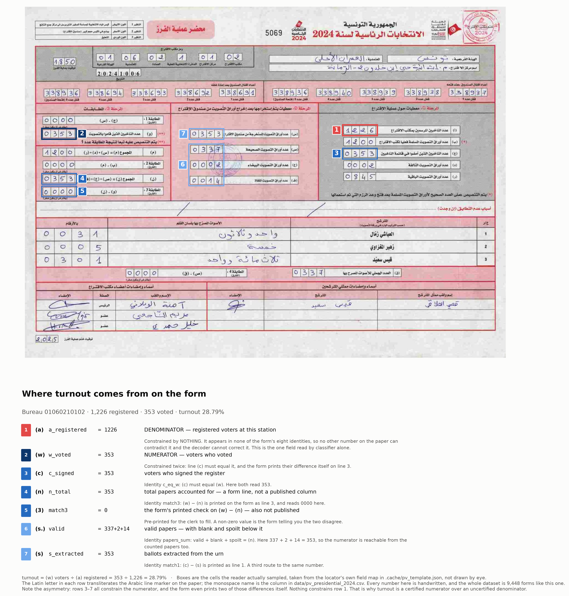

# Codebook

Datasets built from the ISIE archive, and — for 2019, which the archive does not
hold — from the ISIE's own election report and the Wayback Machine. Provenance,
method and known limits for each; see `docs/DATASETS.md` for why these and not
others, and `docs/SOURCE_INVENTORY.md` for what the source archive contains.

Every dataset is reproducible from `tools/` — nothing here was hand-edited.

## Cross-cutting caveats

**Arabic text.** Three distinct corruptions appear in the sources and are handled
separately: PDF text stored as glyphs in *visual* order (reversed on read);
embedded fonts with a defective `ToUnicode` map (letters silently swapped); and
OCR error on scans. Where a field has been repaired, the raw value is kept in a
parallel column so the repair can be audited.

**Coverage is per-collection, never assume national.** The mirror is partial and
says so in different places for different elections. Counts below are what the
sources actually yield, not what the elections actually had.

---

## 1. `data/polling_centres_2022.csv` — polling-centre directory
4,578 rows, one per polling centre. Built by `tools/extract_polling_centres.py`
then `tools/canonicalise_polling_centres.py`.

Source: `uploads/2022/06/Annuaire-codes-USSD-centres-de-Vote-en-Tunisie.pdf`, the
only born-digital tabular PDF in the archive.

| column | meaning |
|---|---|
| `governorate` | canonical governorate (24 distinct, 0 unmatched) |
| `constituency_ar` | constituency as printed (not canonicalised) |
| `delegation`, `imada`, `centre_name` | canonicalised against archive folder names; blank where no confident match |
| `centre_name_fr` | centre name in French, straight from the PDF |
| `ussd_code` | USSD lookup code, 1001–5578, unique per centre |
| `delegation_ar`, `imada_ar`, `centre_name_ar` | raw extracted Arabic, before canonicalisation |
| `*_score` | similarity of the accepted match, 0–1 |
| `source_page` | page of the source PDF |

Resolution: delegation 96.4%, imada 89.2%, centre name 72.3%. Thresholds are
0.72 / 0.75 / 0.82 — centre names need a higher floor because different schools
score ~0.75 on shared boilerplate. **`centre_name_fr` and `ussd_code` are the
reliable join keys**; use `*_score` to tighten the Arabic further.

## 2. `inventory/electoral_geography.csv` — electoral geography gazetteer
26,484 rows parsed from the archive's folder skeleton by `tools/build_manifests.py`.
Covers nine election events; see `docs/DATASETS.md`. Superseded for the PV
collections by dataset 8, which has the real files.

## 3. `data/presidential_applicants_2024.csv` — 2024 presidential aspirants
45 rows. Built by `tools/build_presidential_applicants.py`.

Source: `uploads/2024/07/`, one personalised "استمارة تزكية شعبية 2024" (popular
sponsorship form) per aspirant — the form used to collect the endorsements
required to stand.

| column | meaning |
|---|---|
| `sponsorship_number` | number assigned to the aspirant, 039–999 |
| `name_overlay` | name from the PDF text overlay (authoritative) |
| `name_from_filename` | name from the filename |
| `script` | `arabic` or `latin` |
| `pages`, `source_file`, `drive_id`, `source_url` | provenance |

All 45 carry a number, and overlay and filename agree for 45/45 once spacing and
decomposed hamza are normalised. This is the set issued sponsorship forms, **not**
the set whose candidacies were accepted — three candidates reached the ballot.

## 4. `data/regulatory_corpus.csv` — ISIE regulatory documents
172 rows. Built by `tools/build_document_registers.py` from the dated media
library. Filenames are structured, so the index needs no OCR; `title_from_ocr`
is added where a first-page OCR is cached.

| column | meaning |
|---|---|
| `doc_type` | decision, minutes, guide, statistics, polling_geography, campaign_finance, candidate_list, code_of_conduct, recruitment, legal_text, calendar, communique, list, report, results, other |
| `reference_number`, `reference_year` | parsed from "قرار عدد N لسنة YYYY" or "Décision n° YYYY-NN" |
| `year_published`, `month_published` | from the uploads path, i.e. publication not enactment |
| `language` | ar / fr / mixed, inferred from the filename |
| `title_from_filename`, `title_from_ocr` | subject |

`year_published` is when the file was uploaded and can differ from the document's
own date. 16 rows remain `other`.

## 5. `data/procurement_register.csv` — procurement
72 rows, same builder. `procedure` is one of appel d'offres, appel d'offres
simplifié, consultation, cahier des charges, other. `reference_number` /
`reference_year` are parsed from the filename; `title_from_ocr` is filled for
65/72. 2020–2024.

## 6. `data/local_2023_constituency_turnout.csv` and
##    `data/local_2023_candidate_results.csv` — 2023 local election results
1,715 constituency rows and 3,475 candidate rows from all 248 delegation-level
decisions — 145 first-round (1,202 constituencies) and 103 second-round (513).
The second round was held in early 2024, so its files sit under `uploads/2024/`
despite belonging to the 2023 election; both carry `election = locales_2023` with
`round` 1 or 2. Built by `tools/ocr_cache.py` then
`tools/parse_local_results_2023.py`, with Arabic number-word parsing in
`tools/arabic_numerals.py`.

Candidate table (`local_2023_candidate_results.csv`):

| column | meaning |
|---|---|
| `election`, `round` | `locales_2023`, round 1 or 2 |
| `governorate`, `delegation`, `constituency` | where the seat is |
| `candidate` | candidate name as OCR'd |
| `votes` | vote count |
| `vote_source` | `agree` (words and digits match), `digits-wrong` (words used), `words-only`, `digits-only` |
| `votes_digits_ocr`, `votes_words_ocr` | the two raw readings |

**Why `votes` is trustworthy:** the source prints every count twice, in digits and
spelled out ("بلسان القلم"). The spelled form wins when they disagree. 3,084 of
3,475 rows (89%) are word-validated, and the words correct a misread digit string
in 1,040 cases. The 391 `digits-only` rows are not validated and are marked as such.

Constituency table (`local_2023_constituency_turnout.csv`):

| column | meaning |
|---|---|
| `registered`, `voters`, `votes_spoilt`, `votes_blank` | as OCR'd, reconciled across two passes |
| `votes_valid` | valid votes as OCR'd |
| `candidate_sum` | sum of the candidate votes above — independent of the OCR'd digits |
| `votes_valid_best` | `candidate_sum` where every candidate in the constituency was word-validated, else `votes_valid` |
| `votes_valid_source` | `candidate_sum` or `ocr`, so the choice above is visible |
| `voters_implied` | `votes_valid_best + spoilt + blank` |
| `n_candidates`, `outcome` (`elected` / `runoff`), `winner` | result |
| `ballot_identity_ok` | does `votes_valid + spoilt + blank == voters` on the OCR'd values |
| `candidate_sum_ok` | does `candidate_sum == votes_valid` |
| `turnout_repaired` | which fields the second pass changed, or `unpaired` / `pass-misaligned` |

**The turnout figures are the weak part.** They are printed glued to the following
Arabic word ("247ناخبا") and have no spelled-out backup, so OCR truncates them
often — `ballot_identity_ok` holds for only 27% of rows. Two passes (200 dpi
Arabic; 300 dpi Arabic+English) are reconciled against the identities, which
repairs 296 rows, but 398 could not be paired between passes.

**Use `votes_valid_best` rather than `votes_valid`.** It is anchored on the
word-validated candidate sum for 1,089 of 1,715 constituencies (63%) and falls back
to the OCR'd digits otherwise, with `votes_valid_source` recording which.

Coverage: 248 delegation decisions. The first round spans 15 of the 27
constituencies, so this is a substantial sample of the 2023 local elections, not
the complete national result.

## 7. `data/communications_timeline.csv` — ISIE communications
136 rows, 2018–2024. Built by `tools/build_communications_timeline.py` from
surviving dated permalink folders. Article **bodies were not mirrored**: this is
titles-from-slugs and dates only. The Arabic section's pagination stubs run to
page 14, so the live site carried far more than the 2 Arabic items captured.

## 8. `data/pv_index.csv` — polling-station PV index
23,509 rows. Built by `tools/build_pv_index.py` **from the live isie.tn**, not the
Drive archive — the archive has these folders but every one is empty.

| column | meaning |
|---|---|
| `election` | presidentielle_2024, locales_2023_t1, locales_2023_t2 |
| `governorate`, `delegation`, `constituency`, `sector`, `polling_centre` | path hierarchy (columns used vary by election) |
| `bureau_code` | 8–13 digit polling-bureau identifier from the filename |
| `filename`, `file_ext`, `file_url`, `path` | the scan itself |

Coverage for the 2024 presidential is complete: 24 governorates, 279 delegations,
5,088 polling centres. The files are **scans of handwritten PV forms** (20,915 JPG,
2,378 PDF); this is the index. Their contents are dataset 9.

---

## 9. `data/pv_presidential_2024.csv` — polling-station results, 2024 presidential

9,448 rows, one per polling bureau — every presidential PV in the index. The
station-level count, read off the handwritten scans offline with no model API:
grid detection, a digit classifier trained on labels the forms produced
themselves, and maximum-likelihood decoding under the form's own arithmetic.
Method and validation in [`PV_OFFLINE_READING.md`](PV_OFFLINE_READING.md).

One caveat on completeness: the file has 9,448 rows, one per presidential bureau,
but ISIE filed 14 further PVs under an Arabic school name carrying no bureau code.
Those cannot be joined to a polling station and are not in the dataset.

**Filter before use.** Every row is present, including the ones that could not be
read, so that missingness is visible rather than silent. A cell is empty when the
form's own arithmetic did not vouch for it — never because a value was guessed and
withheld.

Which filter you want depends on what you need.

| you want | filter | rows |
|---|---|---|
| candidate votes | `votes_certified == 1` | **9,419 (99.7%)** |
| ...excluding rows a decision supersedes | `votes_certified == 1 and correction != "held"` | 9,400 (99.5%) |
| ...only the reproducible ones | `votes_certified == 1 and reading != "vision"` | 8,956 (94.8%) |
| the paper count | `papers_certified == 1` | 9,355 (99.0%) |
| ballot accounting | `ballots_certified == 1` | 9,284 (98.3%) |
| every field on the form | `reading == "decoded"` | 8,048 (85.2%) |
| candidate votes, split backed by the words | `split_corroborated == 1` | 8,254 (87.4%) |
| ...total backed by the ballots column too | `valid_corroborated == 1` | 9,321 (98.7%) |

`reading == "decoded"` means the form passed the joint gate whole (`fields_read >=
18`, `cells_corrected <= 3` and `logp_conceded <= 12`) and every column is filled. `reading == "blocks"`
means only the accounts the identities closed were published and the other columns
are empty. `reading == "none"` means nothing on the form could be vouched for.
`reading == "vision"` means the form was read off the scan by eye — see below.

**One filter has two provenances behind it.** Most certified rows come from the
offline pipeline and can be re-derived by anyone who runs `tools/decode_all.py`.
A minority were read directly off the scans, because the classifier cannot see
them: the form draws candidate cells 56×38 in reference coordinates and every
other field about 23×24, so on the 560px scans ISIE published for much of
Medenine the candidates land near 20px wide and `valid` and `q_declared` near
8px. Measured against forms read by eye, the classifier gets the candidates
61–78% right and `valid` 1 time in 17 — and since the votes identity is
`q == valid == the three candidates summed`, two unreadable fields veto a form
however well its candidates are read.

Those rows are admitted on the same evidence as every other row: the candidates
must sum to `valid`, and to `q_declared` where the form fills it in, which is the
test `certify_cells` applies and which a misread digit almost always breaks. What
differs is that **they cannot be reproduced from the code** — nobody can re-run a
pair of eyes. So:

- `votes_certified == 1` gives every row the form's arithmetic vouches for, of
  either provenance.
- `votes_certified == 1 and reading != "vision"` gives the reproducible subset.

**Every published scan has now been looked at.** The 31 stations still without
certified votes are not a backlog; each was opened and the reason it cannot be
published is written down in `data/verification/unreadable_scans.jsonl`, one row
per station with a `reason` and whatever the scan does show:

| reason | stations | what the scan is |
|---|---|---|
| `no_counting_record` | 9 | the bundle holds the polling record or a correction decision, never the counting record — every page was rendered and registered against the layout |
| `truncated_scan` | 8 | the scan stops part-way down the candidate table, so the digits column and later candidates are not on the page |
| `below_resolution` | 3 | the whole page is published at 470–650px, which leaves the four-digit boxes about eight pixels tall |
| does not balance | 3 | legible and read, but the candidates do not sum to the total the form states; both figures are in the register |
| `faint_scan` | 1 | a photocopy whose ink is barely darker than the paper, with the words column left blank |

The three that do not balance are what is left of nine: six were resolved by
their own correction decisions, and one — 14030610201, whose candidate table the
clerk left blank — was recovered from its decision entirely. On the three that
remain, the digits and the Arabic words agree with each other and the papers
block is independently consistent, so the discrepancy is the clerk's arithmetic
rather than the reading. They are left uncertified and recorded rather than
quietly rounded into agreement.

**Some figures on the form were superseded before publication.** The archive
files 388 bureaux with a *قرار تصحيح محضر فرز* — a decision naming a field of the
counting record, the value recorded in error, and the value replacing it.
`data/verification/corrections.jsonl` records all 328 whose table carries
anything, field by field, and `tools/apply_corrections.py` applies them.

A correction is applied only where the error value the decision names is what the
dataset already holds for that field. That check is what ties a decision to a
row: bureau 120611101's bundle holds a decision whose own header codes the
station 12-06-11-1-01-01 while the archive files it under a nine-digit code, and
the row under that code holds a valid of 318 against the decision's 418. Every
error value fails to match and nothing is written. Where a decision is tied to a
row by one matching field, its other figures fill columns the dataset left empty.

This matters most for the candidate columns, because **a decision that changes a
candidate cannot be caught by the arithmetic gate**: the counting record closed
before the correction and closes again after it, so such a row would be published
as certified and be wrong. 29 decisions touch a candidate figure.

A decision is applied whole or not at all, and never if applying it would stop a
row balancing. Six decisions fail that test — they move a candidate or a total
without moving the other, so the corrected form does not close — and none of
those six is applied.

The `correction` column says what happened, per row:

| value | rows | meaning |
|---|---|---|
| `applied` | 51 | a decision's figures were written into this row, and `votes_certified` recomputed from them |
| `held` | 19 | a decision names a different figure for a published field, and it could not be applied — because the error value did not match this row, or because applying it would stop the row balancing. **The published figures for these rows are the ones the commission superseded.** |
| empty | 9,378 | no decision, or one that touched nothing this dataset publishes |

Read `held` as a warning rather than a verdict. It covers both a decision that
plainly belongs to another station and one that belongs to this row and cannot be
reconciled with it; `data/verification/corrections.jsonl` says which, per bureau,
in the note.

**The identities constrain the candidate total, not the split.** `valid == zammel +
maghzaoui + saied` is one equation in three unknowns, so a misreading that moves
votes between candidates while preserving their sum satisfies it exactly as well as
the truth does, and is certified. Bureau 01080310102 was previously published as
Saied 329 / Zammel 85 and reads Saied 389 / Zammel 25 — both sum to 414, both
closed every identity, and the scan says the second is right. Treat `saied`,
`zammel` and `maghzaoui` as classifier output constrained to a certified total,
and `valid` / `q_declared` / `candidate_sum` as identity-certified.

**The votes identity has a blind spot, and `valid_corroborated` is where it is
measured.** `zammel + maghzaoui + saied == valid` cannot catch a misreading that
moves a candidate and the total together: bureau 07070810101 was published as
4/1/141 against a valid of 146, which is arithmetically perfect and wrong — the
form says 7/1/141 against 149. No amount of care inside the votes block can see
that.

### `duplicate_scan`

The dataset has one row per bureau code because that is how ISIE publishes the
archive — one file per code, 9,448 of them — and that count is the denominator
for every share here. It is not quite 9,448 distinct forms. **17 codes are backed
by 8 scans**, and for six of the eight the source files are byte-identical, so
this is a property of the published archive rather than of the reading.

| value | rows | meaning |
|---|---|---|
| `1` | 17 | the archive publishes this scan under more than one bureau code, so the values on this row are not independently sourced |
| empty | 9,431 | this row's scan is its own |

Four of the groups pair a well-formed code with a malformed one — `0101011205`
has ten digits where every real code has eleven, `211301120201` has twelve — and
read as one station published twice. The others pair two well-formed codes, in
three cases naming **different polling centres**: `02110310201` and `02111210201`
are separate centres in مرناق with a single form between them, so one of those
rows holds the other station's numbers and nothing in the archive says which.

Nothing is dropped, because which of a pair is the real one is not a question the
scans can answer and deleting rows would silently move the denominator. If every
code is counted, **2,862 valid votes are counted twice** — 0.11% of the total.
Filtering on `duplicate_scan != 1` removes one row from each group.

`valid` is also one of the three kinds of paper drawn from the box, so the form
states it a second time in an identity that does not involve the candidates at
all: `(س) extracted == (ص) valid + (ع) blank + (ف) spoilt`. Where the ballots
column is published, that second statement is checked and the result recorded:

| value | rows | meaning |
|---|---|---|
| `1` | 9,321 | the ballots column agrees; `valid` is vouched for by two independent identities |
| `0` | 8 | the two disagree. Mostly by one or two — the form's own س and ن can differ, which is what its المطابقة 3 box exists to record — but the row deserves a look before its total is relied on |
| empty | 119 | nothing to check against: 88 certified rows whose ballots column is not published, so `valid` rests on the votes identity alone, plus the 31 rows with no certified votes at all |

`papers_certified == 1` asserts the identity the form writes at **(ن)**:
`n_total == valid + blank + spoilt`. `n_total` is read but not published as a
column, so a row can carry the flag with `s_extracted` empty — the block closed,
just not on the column you can see. That is why `papers_certified` and
`valid_corroborated` are different counts rather than the same one twice: the
first says the paper account closes, the second says the **(س)** column agrees
with it independently.

Reading the words for every station and keeping the values — not just the
agreement bit — puts a bound on the one error the identities cannot see. A
transposition of two candidate rows leaves the total untouched, so no identity on
the form objects; it shows up only as the three word values being right and
assigned to the wrong candidates. Across the 9,279 certified stations whose words
are readable there are **no such rows left**, and the screen is checked against the
four that were found and fixed, all four of which it catches. See
`docs/PV_OFFLINE_READING.md`.

That blind spot was not hypothetical. Reading the ballots column found three rows
whose votes identity closed on the wrong numbers, and a plausibility check found
56 more where the reader had turned a blank leading cell into a 7 — see
`docs/PV_OFFLINE_READING.md`. Filter on `valid_corroborated == 1` when the total
matters more than the coverage.

`split_corroborated` is what can be offered instead of an identity. The form
writes each score a second time in Arabic words beside the digits, and this column
is 1 when a separate reader of that column agrees with all three published
figures, 0 when it does not, and empty when the words could not be read. It
overrules nothing — the word reader is the weaker of the two and no value is taken
from it — but the errors concentrate where the two disagree. Of the pilot's 90
hand-verified scores, the 73 the two channels agree on are all correct, and both
of the cell reader's two errors fall among the 17 they differ on.

Read the column for what it is. Two errors is a thin basis: zero wrong in 73 puts
the agreed set under about 4%, which is not yet distinguishable from the 2.2% base
rate, so this shows the errors concentrating rather than proving the agreed rows
cleaner. `split_corroborated == 0` also does not mean the row is wrong — on the
pilot the digits were right in 15 of the 17 disagreements. It means the split is
worth checking against the scan if the analysis turns on it. Corpus-wide, 7,974 of
the 8,954 rows the reproducible pipeline certifies are corroborated, 833
contradicted and 147 unreadable; restricting to the corroborated rows moves the
aggregate by about 0.1pp. Of the 464 rows read by eye, 280 are corroborated and 43
still carry an empty flag, because the words model needs the printed grid that
those forms are missing — there the column says "not assessed" rather than "not
corroborated".

**This column was wrong for most of the project's life, in both directions.** It
was computed once, when the words reader was finished, and then the *digit* side
kept moving: whole-field reading, alternate-page selection, the correction
decisions and the hand repairs all changed published candidate values afterwards,
and nothing re-ran the flag. So it was comparing the current words against digits
that in places no longer existed. Recomputing it against the file as published
moved 1,043 rows from `0` to `1` — corroboration that was being thrown away — and,
worse, 128 rows from `1` to `0`: rows sitting inside the filter this section
recommends without the words actually backing them. No candidate value was in
question, because on all 150 withdrawn rows the digits close the votes identity
and the words do not, so the digits stand and the words are the failing channel.
`tools/refresh_splits.py` now recomputes the column from a dump of what the words
reader read, so it can be re-derived against new digits without a model run.

Two exemptions travel with it. Where `correction == "applied"` the flag is
**empty rather than 0**: the published value comes from a decision that supersedes
the counting record, so the words the reader sees are the *superseded* figure and
a disagreement is the expected outcome. And rows corrected by eye against the
words at magnification keep the flag that hand reading set, because it is better
evidence on the split than the model's own pass over the same cells.

On the hand-verified pilot the decoded rows are exactly right on all 18
constrained fields, and certified field values were right in 255 of 255 cases.

Rows published as blocks and rows decoded whole now agree closely on Saied — 90.87%
against 90.85% — and within the 249 delegations carrying both, the paired median
difference is +0.06pp. They still cover different polling stations, so mixing them
changes the weighting on the smaller candidates.

One calibration note, and a correction to an earlier version of this file. When
coverage first reached 83% of bureaux the aggregate had drifted on the smaller
candidates — Zammel 6.90% against a reported 7.35% — and this file recorded that as
unexplained. It was classifier error on the degraded scans that had just become
readable, which the training set did not yet cover. Harvesting labels from those
forms and retraining moved Zammel to 7.17% and Maghzaoui from 2.24% to 1.99%
against a reported 1.97%, with no change to the reader. The remaining gap on Zammel
is 0.18pp.

Note that the national figures are the widely reported ones rather than numbers
sourced from ISIE, whose own results pages are empty, so this is a sanity check
rather than a reconciliation. The smaller candidates' shares remain the figures
most sensitive to any residual reading error.

| column | meaning |
|---|---|
| `bureau_code` | 11-digit polling-bureau identifier; joins to `pv_index.csv` |
| `governorate`, `delegation`, `sector`, `polling_centre` | from the index (presidential collection only) |
| `a_registered` | registered voters (أ) — **see the caveat below** |
| `b_delivered` | ballot papers delivered (ب) |
| `c_signed` | voters who signed the register (ج) |
| `d_damaged`, `r_remaining` | damaged (د) and unused (ر) ballots |
| `s_extracted` | ballots extracted from the urn (س) |
| `valid`, `blank`, `spoilt` | valid (ص), blank (ع) and spoilt (ف) papers |
| `w_voted` | voters who voted (و) |
| `q_declared` | declared valid votes (ق) |
| `zammel`, `maghzaoui`, `saied` | votes for each candidate |
| `candidate_sum` | the three candidate counts added up |
| `turnout_pct` | `w_voted / a_registered`, blank where `a_registered_ok` is 0 |
| `saied_share_pct` | `saied / candidate_sum` |
| `a_registered_ok` | 1 when `a_registered >= w_voted`; 0 flags a reading known to be wrong |
| `reading` | `decoded` (whole form passed the joint gate), `blocks` (only the accounts its identities closed), `none` |
| `votes_certified`, `papers_certified`, `ballots_certified` | 1 when the form's arithmetic vouches for that account's columns — either because the independent cell-by-cell reading closed its identity, or because the decoder closed it while overruling at most one cell in that block |
| `identities_ok` | how many of the eight identities the **independent** cell-by-cell reading satisfied, before any correction (0–8) |
| `cells_corrected` | cells the arithmetic had to overrule to reach a consistent reading |
| `logp_conceded` | log-likelihood given up to reach consistency |
| `margin` | log-likelihood gap to the next reading the identities also admit |
| `fields_read`, `fields_published`, `fields_located` | fields the decoder resolved; fields actually written to this row; fields in the layout used (detected, or placed from the template where detection came up short) |
| `status` | `read` (something was published), `unverified` (read but nothing the form vouches for), `no_grid`, `unreadable` |

**`a_registered` is the weak column.** It appears in none of the form's identities,
so nothing on the paper checks it and the decoder cannot correct it — it is the one
field read by classifier alone. `a_registered_ok` flags the 0.3% of published rows
where it reads lower than the turnout it is supposed to exceed; the rest are
plausible but uncertified. Every other column is either certified by an identity,
determined by columns that are, or — for the three candidate columns specifically —
constrained only in its total, as described above.

**Coverage is not random.** The forms that fail are the low-resolution scans —
median width 1130px against 1600px for the ones that read — so any station-level
analysis should treat the published subset as a sample skewed toward better-scanned
stations, not as a random one. Aggregates over the published rows come to Saied
**91.12%**. The number to compare that against is **not** the widely reported
90.69%: these are counting records from *inside the republic* (محضر عملية الفرز
داخل الجمهورية) and the reported total includes out-of-country voting, where Saied
took 77.99%. Subtracting ISIE's own published diaspora totals from its national
ones gives an in-country share of **91.17%** — five hundredths of a point from
this dataset. `tools/reconcile_national.py` recomputes it. That is a reconciliation
of aggregates, which can hide compensating errors, and it certifies no individual
row; the per-row flags do that.
An earlier version of this file cited a closer agreement as evidence of accuracy;
that agreement narrowed as the reader got *worse*, so it was not measuring what it
appeared to.

---

## 10. `data/delegations_ins.csv` — official 2024 delegation list
264 rows, one per delegation. Ingested by `tools/build_geo_crosswalk.py` from
`data/sources/list_delegations_code_ins.csv` (committed verbatim).

| column | meaning |
|---|---|
| `id` | row number in the source file |
| `region_name` | one of six planning regions (Nord/Centre/Sud × Est/Ouest) |
| `governorate_name` | governorate, French transliteration (24 distinct) |
| `delegation_name` | delegation, French transliteration (263 distinct over 264 rows) |
| `id_delegation` | **INS code**, unique; first two digits are the governorate |
| `id_delegation_merged` | code under the merged-delegation scheme (217 distinct) |
| `id_delegation_salb_un` | SALB/UN code, `TUN0NNNNN`, unique — the key to boundary files |
| `id_delegation_1984` | code under the 1984 division (199 distinct) |
| `lat`, `lon` | delegation centroid, filled on all 264 rows |
| `comments` | empty throughout |
| `name_key` | `delegation_name` folded (see below) |

`Ezzouhour` is a delegation of both Tunis (`1162`) and Kasserine (`4253`). That
homonym is the only one, and it is why a name alone cannot identify a delegation.

## 11. `data/hist_localities.csv` — historical localities, resolved
1,276 rows, one per locality-as-recorded. Built by `tools/build_geo_crosswalk.py`
from `data/sources/db_hist_geonames_tunisia.csv`; checked by
`tools/audit_locality_names.py`.

**A row is a source observation, not a place.** Two rows can record the same
locality from two census tables (an `educ_*` row and a `pop_tun_*` row), and no
row is ever deleted, because deleting one would lose a census record. 14 such
pairs are listed in the verification log, alongside 5 pairs that merely share a
name and are distinct places.

| column | meaning |
|---|---|
| `id_2024` | **row index, 1–1278 — not a 2024 delegation code.** Only 28 of 1,276 values happen to equal an `id_delegation`; treat any resemblance as coincidence |
| `id_census` | source-table key: `educ_*` (147), `pop_tun_*`, `pop_eur_*` (1,115 rows in total) |
| `city_name_sources` | name **exactly as printed in the source**. Immutable, and verified byte-identical to the upload |
| `city_name` | the canonical name. The only name column that is edited |
| `id_geonames` | local sequence 1–1327, **not a GeoNames id** (those are 7 digits) |
| `caidat_1926`, `caidat_1931` | caïdat the locality sat in (707 / 740 rows) |
| `controle_civil_1931` | contrôle civil (1,116 rows) |
| `delegation_1956` | 1956 delegation (49 rows), with its `Délégation de` title removed |
| `lat`, `lon` | locality coordinates, on 1,171 rows |
| `sources_lat_lon` | `Google Maps`, `Geonames` or `Mindat` — canonicalised from eight spellings of three sources |
| `comments` | the author's notes (402 rows) |
| `geo_precision` | 1 exact, 2–3 a parent-unit centroid shared by several localities |
| `name_key` | `city_name` folded |
| `id_delegation`, `delegation_name`, `governorate_name`, `region_name` | the modern unit, blank where unresolved |
| `match_method` | how it was resolved — see the table below |
| `match_score` | 1.0 for a name match, the ratio for a fuzzy one, blank for a centroid |
| `match_km` | distance to the delegation it was assigned |
| `match_margin_km` | how much closer the nearest centroid was than the second nearest |

### The fold

`tools/latin_names.py:fold` strips combining accents, lowercases, drops
apostrophes, and treats hyphen and space alike, so `Menzel-Bourguiba` compares
equal to `Menzel Bourguiba` and `M'saken` to `M’saken`. Neither file's house
style was rewritten to the other's: the locality file hyphenates (646 of 1,211
`city_name` values), the INS list uses spaces, and both keep their own spellings.
The fold is safe as a key — 0 collisions across the 263 distinct INS delegation
names.

### How localities were resolved

| `match_method` | rows | meaning |
|---|---|---|
| `centroid` | 1,060 | nearest INS delegation centroid |
| `name_and_centroid` | 108 | name matches a delegation and the nearest centroid agrees |
| `hist_unit_governorate` | 78 | no coordinates; placed by the historical unit, which resolves only to a governorate |
| `hist_unit_delegation` | 14 | no coordinates; the historical unit resolves to a delegation |
| `unresolved` | 12 | no coordinates, no name match, no usable historical unit |
| `name_over_centroid` | 2 | name kept where the nearest centroid was a neighbouring delegation |
| `name_fuzzy` | 1 | no coordinates; name matched above 0.92 |
| `centroid_name_rejected` | 1 | name matched a delegation too far away to be this place |

1,264 of 1,276 resolved (99.1%); `id_delegation` on 1,186, a governorate on 1,264.

**Why distances are published instead of a confidence score.** The centroid
fallback cannot be self-calibrated. The only subset with an independent answer is
the 111 localities whose name *is* a delegation name — and the nearest centroid
returns that same delegation 108 times (97.3%). That subset is biased by
construction: those localities are delegation seats, which sit on centroids (p50
0.4 km). Ordinary localities do not (p50 6.1 km, p90 13.7, p99 20.8, max 52.4),
and a 40 km distance in Tataouine or Kébili is normal rather than wrong. A
nearest/second-nearest margin guard is measurably the wrong guard too: 14 of the
correct assignments have a margin under 2 km, while the one real error had 3.1 km.
So `match_km` and `match_margin_km` are published and the analyst filters.
**The honest upgrade is point-in-polygon against real boundaries**, for which
`id_delegation_salb_un` is the key; the repo holds no shapefiles.

**An exact name match is bounded by distance.** `El-Ksar` ("the castle") folds
onto the Gafsa delegation `El Ksar` while sitting near Nebeur in Kef. Of the 111
name matches, 110 sit within 19.0 km of the delegation they name and `El-Ksar`
alone sits at 218.9, so `NAME_TRUST_KM = 40` — twice the observed legitimate
maximum — rejects it and it resolves by coordinates instead.

## 12. `data/hist_unit_crosswalk.csv` — historical units to modern ones
70 rows, one per distinct name appearing in `caidat_1926`, `caidat_1931`,
`controle_civil_1931` or `delegation_1956` (2,612 cells in total).

| column | meaning |
|---|---|
| `historical_name` | the name as it appears, title removed |
| `name_key`, `columns`, `cells` | folded key; which columns use it; how many cells |
| `modern_level` | `governorate`, `delegation`, or blank |
| `modern_name`, `governorate_name`, `id_delegation` | the modern unit |
| `method` | `exact` (36), `manual` (12), `fuzzy` (12), `no_modern_equivalent` (10) |
| `score`, `note` | match ratio; and why, for every non-exact row |

**Every name is decided individually, and it had to be.** At a 0.70 fuzzy cutoff
the matcher gets 13 right and 7 badly wrong: `Hammama`, a tribal confederation of
the Gafsa steppe, scores 0.80 against `Hammamet`, a Nabeul beach town; `Nefzaoua`,
the Kébili oases, scores 0.77 against `Nefza` in Béja; `Djerid` and `Djerba` both
score 0.71 against `Djerissa` in Kef. `HIST_FUZZY_MIN` is 0.85, where all 12
survivors are correct (`Maktar`→`Makthar`, `Tadjerouine`→`Tajerouine`,
`Redeyaf`→`Redeyef`, `Dehibat`→`Dhehiba`, …), and everything below it is asserted
by hand (`Souk-el-Arba`→`Jendouba`, `Souk-el-Khemis`→`Bou Salem`,
`Djemmal`→`Jammel`, `Sidi Amor Bou Hadjela`→`Bouhajla`, `Fahs`→`El Fahs`,
`Le Kef`→`Kef`).

**Ten names have no modern counterpart, by design, and are not forced onto one.**
Tribal caïdats covered populations rather than territories (`Aradh`, `Djelass`,
`Fraichiches`, `Hammama`, `Madjeur`, `Ouerghemma`, `Oulad-Aoun`, `Oulad-Ayar`),
and the colonial catch-alls spanned several of today's governorates
(`Territoires du Sud`). One cell names three units at once
(`Medenine, Ben-Gardane, Zarzis`, 36 rows) and is left for the author to split.

## 13. `data/verification/locality_names.jsonl` — what was changed and why
One record per change and per judgement call, keyed by `kind`:

| `kind` | n | meaning |
|---|---|---|
| `hist_unit_fallback` | 92 | a locality placed by the historical unit it records |
| `historical_unit` | 70 | one row per crosswalk decision |
| `city_name_filled` | 52 | `city_name` filled from the source name |
| `strip_prefix` | 49 | `Délégation de` removed |
| `source_label` | 32 | `sources_lat_lon` casing |
| `trim` | 31 | whitespace |
| `duplicate_row_candidate` | 19 | two rows sharing a name: 14 one place from two sources, 5 distinct namesakes |
| `empty_city_name` | 13 | left empty as a residual source category |
| `merge_spelling` | 10 | one toponym rendered two ways |
| `name_centroid_conflict` | 2 | name kept over the nearest centroid |
| `composite_cell`, `colocated_distinct_pairs`, `name_fuzzy`, `name_coincidence` | 1 each | see above |

Two of the spelling merges unify names borne by *different* places
(`Chaal`/`Chaâl` are 71 km apart; `Ouled Sidi-Tlil` spans Thala and Gafsa). That
is deliberate: the merge normalises how one toponym is written and asserts
nothing about place identity, which is what the `duplicate_row_candidate`
verdicts are for.

**Still missing: the Arabic↔Latin bridge.** These three datasets are Latin-script
with codes; `data/pv_presidential_2024.csv` and `data/polling_centres_2022.csv`
are Arabic-script without them. The 24 governorates align, but the PV file's 277
distinct `delegation` values do not map cleanly onto the official 264, and no
transliteration capability exists in the repo. The one available seed is
`polling_centres_2022.csv`'s `centre_name_fr`, which is aligned row-wise to
Arabic `delegation` and `imada`.

## 14. `data/delegation_crosswalk.csv` — Arabic ISIE names to official INS codes
279 rows, one per ISIE delegation unit. Built by `tools/bridge_delegations.py`,
checked by `tools/audit_delegation_bridge.py`. **This is the join between the
Arabic-script election data and the Latin-script official geography.**

| column | meaning |
|---|---|
| `isie_code` | ISIE's own 4-digit (constituency, delegation) code — the first four digits of `bureau_code` |
| `governorate_ar`, `delegation_ar` | the Arabic names, as ISIE writes them (corrected where noted below) |
| `governorate_name`, `delegation_name` | the French names from the INS list; blank where no counterpart |
| `id_delegation` | **official INS code**, the key to `data/delegations_ins.csv` |
| `id_delegation_salb_un` | SALB/UN code, for boundary files |
| `region_name`, `lat`, `lon` | carried from the INS row |
| `stations` | polling stations in this unit, of 9,448 |
| `match_method` | `skeleton` (262), `manual` (2), `no_ins_counterpart` (15) |
| `match_score`, `match_margin` | cross-script similarity, and how far it beat the runner-up |
| `corroboration` | independent check — see below |

**`bureau_code` carries a delegation code, and it is the more reliable label.**
Its first four digits are ISIE's own (constituency, delegation) pair. They are
not INS codes — comparing them to `id_delegation` directly matches nothing,
which is why the codebook previously recorded `bureau_code` as undecomposable.
Over 9,448 stations they partition the delegations almost perfectly: 16 single-
or double-station code typos (logged, and the label is trusted over the code for
those), and one systematic disagreement, which turned out to be ISIE's error
rather than the code's.

### How the two scripts are matched

`tools/arabic_latin.py`. Two ideas do the work, and both were forced by measurement.

**Consonant skeletons.** Arabic script writes consonants and long vowels; French
transliteration writes every vowel, and vowels are where transliteration is
least predictable. Reduce both to consonants and `سوسة` and `Sousse` are both
`sws`; `السيجومي` and `Sijoumi` are both `sjm`. Arabic ي is dropped, because in
place names it is almost always the long vowel French writes as `i` — keeping it
made the two scripts disagree on 9 of 11 test names. و is kept, because French
writes it `ou`, which maps back to `w`.

**Qualifiers are translated, not transliterated.** `بنزرت الشمالية` is
`Bizerte Nord`. Transliterating الشمالية yields `cmly`, which resembles `Sud`
about as much as `Nord` — so a pure skeleton matcher returns the wrong half of a
north/south pair at random, and the first prototype did exactly that. Compass
words, `مدينة`, `حي` and `اعلى` therefore go through a lexicon, and a candidate
whose qualifier disagrees is **rejected outright rather than scored**, since the
difference is one word against a stem that already matches perfectly.

Thresholds: `MATCH_MIN` 0.62 and `MARGIN_MIN` 0.02, both against the measured
score distribution, and matching is scoped to the governorate (24 pairs mapped
by hand, ~11 candidates each). Two names are asserted by hand because no
skeleton can reach them: `جرجيس` is `Zarzis` (ج renders as Z) and `حلق الوادي`
is `La Goulette` — a French calque of "throat of the river", not a
transliteration at all.

### The bijection, and why it is the real check

**All 264 official delegations are claimed by exactly one ISIE unit, and none is
claimed twice.** That is the invariant worth testing, because a cross-script
matcher fails by pairing two names that merely look alike — and that failure
always shows up as one delegation claimed twice while another goes unclaimed.
Getting there caught three genuine bugs:

- **`ق`, `غ` and `ك` must stay distinct.** Folded together, `Agareb` (عقارب) and
  `Ghraiba` (الغريبة) both reduce to `krb`, so each tied with the other's Arabic
  name at a perfect score and the margin guard rejected both. Two real Sfax
  delegations were lost that way. French mirrors the distinction: `gh` is غ,
  plain `g` is ق.
- **A qualifier key written with ى is unreachable**, because `ar_norm` folds ى
  to ي. `اعلى` never matched, so `العمران الاعلى` matched the unqualified
  `El Omrane` and two units claimed one delegation while `El Omrane Supérieur`
  went unclaimed.
- **Grapheme rules must be applied in one pass.** Run sequentially, `ch`→`c`
  turns `Echebika` into `ecebika`, whereupon a `ce`→`se` rule fires on a `c`
  that was never there. That mismatch put `الشابة` on `Chorbane` instead of
  `Chebba`.

### Corroboration, from an independent channel

`data/polling_centres_2022.csv` pairs Arabic `delegation` with French
`centre_name_fr` row by row, built from a different source by a different
pipeline. For 226 of 264 matches (85.6%), the matched French delegation name
appears among that delegation's own centre names. 14 delegations are absent from
that file and 24 are present but uncorroborated — **with no contradictions
anywhere**. The channel confirms but cannot refute: centres are named after
schools and localities (`قرقنة` → `Kerkenah` is uncorroborated only because its
centres are named for villages), so a low `corroboration` is not evidence of a
wrong match.

### The 15 units with no official counterpart

184 stations, 1.9% of the dataset. Left unmatched rather than forced onto a
neighbour: `السعيدة`, `الحامة الغربية`, `البرادعة`, `زانوش`, `دخيلة توجان`,
`الهيشرية`, `منزل المهيري`, `وذرف`, `بني مهيرة`, `الطويرف`, `رجيش`,
`عين جلولة`, `سيدي بوبكر`, `حامة الجريد`, `رجيم معتوق`.

Whether these are delegations created after this INS list's vintage or ISIE
subdivisions cannot be settled from the data here, and is not asserted. What the
data does show: 14 of the 15 are standalone names, while `الحامة الغربية`
(El Hamma Ouest) extends `الحامة`, which is separately present and matched — so
that one reads as a subdivision.

## 15. `data/pv_delegation_map.csv` — station to official delegation
9,448 rows, one per polling station, keyed on `bureau_code`. Join this to
`data/pv_presidential_2024.csv` to give every station an official INS delegation
code. It exists as a separate file rather than as columns on the PV dataset,
which is left byte-identical.

| column | meaning |
|---|---|
| `bureau_code` | the PV dataset's key |
| `isie_code` | `bureau_code[:4]`, ISIE's delegation code |
| `governorate_ar` | as published |
| `delegation_ar_published` | the label exactly as the PV dataset carries it |
| `delegation_ar` | the label after the corrections below |
| `governorate_name`, `delegation_name`, `id_delegation` | the official geography |
| `label_change` | `""`, `misfiled_by_isie`, or `disambiguator_trimmed` |

**Use this rather than joining on the Arabic delegation label**, because for 110
stations that label is wrong.

### ISIE's folder tree nests two delegations inside a third

The raw path of a Ben Guerdane station is
`.../مدنين/جربة أجيم/بنقردان/الشهبانية/...`. ISIE's tree files every Ben Guerdane
and Beni Khedech station under `جربة أجيم` (Djerba Ajim), which is why that
delegation carried 135 stations against Djerba Midoun's 55, and why Ben Guerdane
and Beni Khedech appeared to be missing from a dataset that covers every station
in the country.

**ISIE's own `bureau_code` contradicts ISIE's own folder tree** and separates
them cleanly: `2301` Ben Guerdane (70 stations), `2302` Beni Khedech (40),
`2303` Djerba Ajim (25). The `sector` column corroborates, reading `بنقردان` on
69 of the 70 and `بني خداش` on all 40. Corrected by code, flagged
`misfiled_by_isie`, and the one station at `2301` whose sector still reads
`جربة أجيم` is recorded as such in the verification log rather than smoothed over.

`disambiguator_trimmed` (51 stations) is a different and much smaller thing:
`Ezzouhour` is a delegation of both Tunis and Kasserine, so ISIE writes
`الزهور - تونس` and `الزهور - القصرين`. The trailing governorate is a
disambiguator, not part of the name. These two classes are kept apart because
one says ISIE was wrong and the other says it was right.

## 16. `data/verification/delegation_bridge.jsonl` — the bridge's judgement calls

| `kind` | n | meaning |
|---|---|---|
| `uncorroborated` | 24 | matched, but no French centre name echoes it |
| `bureau_code_typo` | 16 | one or two stations whose delegation code disagrees with the rest of their delegation; the label is trusted and no station moves |
| `no_ins_counterpart` | 15 | an ISIE unit with no delegation of that name in the INS list |
| `isie_label_fix` | 2 | the Ben Guerdane and Beni Khedech misfilings, with their evidence |
| `manual_match` | 2 | `Zarzis` and `La Goulette`, with reasons |

## 17. Candidate margins — `data/station_margins.csv` and its aggregates
Four tables built by `tools/build_margins.py`, checked by `tools/audit_margins.py`:

| file | rows | unit |
|---|---|---|
| `data/station_margins.csv` | 9,448 | polling station |
| `data/imada_margins.csv` | 2,042 | imada (sector), keyed on `adm4_pcode` |
| `data/delegation_margins.csv` | 264 | delegation, keyed on `adm3_pcode` |
| `data/margin_summary.csv` | 465 | the distributions: n, mean, sd, min, p10/p25/p50/p75/p90, max per metric, at each level, nationally and by region and governorate |

Per-candidate columns, for `saied`, `zammel`, `maghzaoui`:

| column | meaning |
|---|---|
| `<cand>` | votes |
| `<cand>_share_pct` | share **of valid votes** (the three sum to 100) |
| `<cand>_margin_pp` | that candidate's share minus the **strongest rival's** — positive for whoever leads the unit, negative for the others |

Plus `winner`, `runner_up`, `margin_pp` (the winner's lead), `turnout_pct`,
`registered`, `voters`, `valid`, `blank`, `spoilt`, geography in both scripts,
and at aggregate level `n_stations` and `n_certified`.

**Shares are of valid votes**, so a share is scale-free and aggregating upward is
a plain sum of votes rather than a mean of means.

**Vote sums use the certified basis** — 9,419 of 9,448 stations — which is the
convention `tools/reconcile_national.py` already uses and which reproduces the
published national figures exactly (2,303,043 / 176,525 / 47,847 = 2,527,415;
91.12 / 6.98 / 1.89). The two bases differ by exactly one station: `10020210101`
in El Mida reads 232 + 0 + 1 = 233 against a published `valid` of 333, on a form
with no recoverable grid, so a digit in it is known to be wrong. Its own row keeps
its shares, flagged `complete` but not `votes_certified`, so a reader can see it
rather than wonder where it went.

### The spatial join

`adm3_pcode` in the OCHA/HDX boundary set is `TN` + the INS `id_delegation`, so
**the delegation join is by code and exact**: 264 pcodes, 264 INS codes, empty
symmetric difference. That is also an independent corroboration of the delegation
bridge in §14.

Below that, the imada join is by Arabic name scoped inside the delegation, where
the candidate set is small (median 7, max 17). **9,407 of 9,448 stations (99.6%)
resolve to one of 2,042 imadas**, by these methods (`imada_match_method`):

| method | meaning |
|---|---|
| `scoped` | matched inside its own delegation at ≥ 0.85 |
| `scoped_near` | 0.75–0.85, accepted because it leads its runner-up by ≥ 0.15 |
| `governorate_recovery` | the station had no INS delegation; matched across the governorate, and the imada's own parent then supplied the delegation |
| `unmatched` | left as a gap, and drawn as such |

Three measurements shaped that:

- **The main floor is 0.85 because of one case.** `صاحب الجبل الجوفية` and
  `صاحب الجبل القبلية` — northern and southern Sahib El Jebel, two different
  imadas — score 0.812 against each other, so any floor at 0.80 would merge them.
- **The second tier is gated on margin, not score.** Several admin4 names carry
  what look like transcription slips against the PV file — `صانوش` for `زانوش`,
  `صقانص` for `صقانس`, `الفنة` for `القنة`, `طمزرط` for `تمزرط` — scoring around
  0.80. What makes them safe is that each leads its runner-up by 0.20–0.45 inside
  its delegation, while the Sahib El Jebel pair collapses to 0.025 because three
  such imadas exist. The floor sits between.
- **A sector name pairs the imada with its delegation, in either order.**
  `العامرة - (سبالة أولاد عسكر)` puts the place first; `منزل بوزيان - الخرشف`
  puts the delegation first. Assuming the first form collapsed all seven
  `منزل بوزيان - X` sectors onto one imada at a perfect score; offering both
  sides blindly created the opposite error, because a delegation seat usually has
  an imada of the same name. What resolves it is the delegation, already known per
  station: the part that repeats it is the qualifier.

**The 184 stations that had no delegation are now all placed.** 53 sector names
matched an imada elsewhere in their governorate — 48 of them exactly — and the
imada's own `adm3_pcode` supplied the parent: `دخيلة توجان` into Mareth,
`رجيم معتوق` into Faouar, `الطويرف` into Nebeur, `رجيش` into Mahdia. Every one
lands in the right governorate and a plausible neighbouring delegation.

`imada_subdivided` in the log records the 5 imadas that ISIE polls as several
sectors (`الفريو 1`/`الفريو 2`); their votes are summed into the one imada. That
is expected, and the same check is what caught the `منزل بوزيان` collapse.

### Why the audit measures geography

A name-based join can scramble which unit gets which result while every total
still adds up, so arithmetic cannot detect it. Geography can. `audit_margins.py`
measures the share of variance in Saied's share explained by the parent unit and
compares it to a shuffle of the same values: **44.7% against 8.6% at delegation
level, 62.1% against 12.3% at imada level.** The finer level is *more* spatially
coherent, which is what correct nesting predicts. Permuting whole result blocks
between units — what a scrambled join actually looks like — drops those to 8.8%
and 13.4%, and the check fires.

## 18. `data/maps/` and `maps/` — the joined geometry and the figures
`data/maps/{delegation,imada}_results.geojson` carry the boundary geometry with
every result column joined on, simplified to 0.004° and 0.002°. `maps/` holds 474
figures in seven folders, one per producing tool: `national/` (30), `cartograms/`
(12), `surfaces/` (33), `comparative/` (27), `levels/` (36), `zoom/` (150) and
`micro/` (186). `national/` is the four maps at each level in PDF, PNG and SVG
plus a composite of each; `cartograms/` is the same four as **vote-weighted
Dorling cartograms** at delegation level (`tools/make_cartograms.py`).

The cartograms answer the objection the choropleths cannot: circle area is the
delegation's certified valid votes, so ink tracks the electorate rather than the
terrain. Same fixed 0–100% scale, same ramp, so the two are directly comparable.
Packing is measured — zero remaining overlap, median displacement 1.6% of the map
diagonal — and positions are consequently approximate, which the figure says on
its face. Sized on the certified candidate sum rather than the `valid` column so
that area and colour rest on the same basis; the two differ by 601 votes (0.02%),
all from stations publishing a valid total whose candidate figures are not
certified.

**Read `maps/README.md` before reading the maps.** Three things there matter more
than anything in the styling: area is not votes (the ten largest delegations are
40.6% of the map and 2.29% of the vote); **two scales are published as a pair** —
everything outside `maps/fitted/` runs on one fixed 0–100% scale, so a shade
means the same number on every figure but most maps consequently read flat
(99.6% of delegations sit in one seventh of the range for Maghzaoui), while
`fitted/` runs the ramp over each map's own range, which recovers the geography
at the cost that a shade means nothing elsewhere; and the margin map is
sequential rather than diverging because Saied's margin never goes negative at
delegation level.

**How much fitting buys depends on how coarse the units are**, which is a fact
about the data rather than the styling. It pays most on the aggregated margin
rollups — 23.5× for `maghzaoui_margin_region`, 9.3× at governorate level —
because a signed margin's fixed scale is 200 points wide while six regions span
8.5 of them, leaving the fixed versions very nearly flat. Then 6.8× for
`maghzaoui_delegation`, 4.3× for `maghzaoui_kde`, 3.2× for `turnout_delegation`.
It pays least at imada level, where 2,042 units guarantee someone polls 0% and
someone 100% so the extremes pin the ramp: 1.3× for `turnout_imada` and 0.9× —
a loss — for `margin_imada`, whose −10.83 to +100 span is *wider* than the fixed
scale. And nothing at all for coverage — 1.05× and 1.00× — which is the one
quantity here that really does use the whole of 0–100. Each fitted figure carries a strip showing its window against the full
range, so the exaggeration is visible rather than silent.

The rank maps, the ratio basis, `clusters/`, vote density, the electorate as a
head count and the kernel bandwidth have no fitted counterpart: none of them is
a percentage with a full range to depart from.

`maps/comparative/compare_{rank,ratio,opposition}_*` are built for reading colours **across**
candidates (`tools/make_comparative.py`), which the per-candidate maps cannot
support. The obstacle is arithmetic: Saied's 91.12% national share caps his ratio
to his own average at 1.10× (observed 0.48–1.10×), while Zammel and Maghzaoui
range 0.00–7.85× and 0.00–21.51×, so no single scale serves all three. Hence
three figures with three stated bases — `rank` (equal-count classes per
candidate: same shade, same standing in that candidate's own spread, comparing
geography and setting level aside), `ratio` (one shared scale in half-powers of
two around 1.00×: same shade, same multiple of that candidate's national
average), and `opposition` (the combined non-Saied share, and Zammel's share of
it with a boundary at the 50% runner-up line). Each is built at three levels:
**governorate** (24 units, the level at which governorates can be compared to
each other at a glance), delegation (264) and imada (2,042). Governorate totals
are summed from the delegation table — `adm2_pcode` is the first four characters
of `adm3_pcode` — and reproduce the published figures exactly (2,303,043 /
176,525 / 47,847 = 2,527,415). By governorate the ratio ranges are Saied
0.93–1.05×, Zammel 0.38–1.86×, Maghzaoui 0.49–3.44×; Kebili is the outlier, with
Maghzaoui at 3.44× his national share against Zammel's 0.94× of his. Zammel leads the non-Saied vote in
257 of 264 delegations and 1,729 of 2,037 imadas; **72 imadas are exact ties**
between the challengers on counts of 1 to 38 votes, so the imada runner-up is not
a solid category and the figure says so.

`maps/surfaces/*_kde.*` add kernel-smoothed surfaces from the 2,042 imada centroids
(`tools/make_kde.py`): a vote-weighted Nadaraya–Watson estimate of each
candidate's share, contoured at the choropleths' own class breaks, plus a
vote-density surface in votes per km² and `local_bandwidth_kde` showing the
smoothing scale itself.

**The bandwidth is local.** The spacing between samples spans a factor of 650
(median nearest neighbour 4.2 km, densest 0.16, sparsest 104.6), so each sample
is smoothed over its own nearest-neighbour distance rather than a national
constant. Chosen by leave-one-out cross-validation weighted by votes at stake:
2.718 pp weighted MAE against 4.003 pp for the fixed 25 km this replaced and
3.077 pp for the best fixed width (1 km). Local beats every fixed bandwidth, the
fixed family has a real interior optimum, and no floor is imposed because every
floor tested made the error worse. Kernels are normalised per sample
(1/2πh²), so a wide kernel spreads its weight rather than carrying more of it and
the density surface stays a density — verified by integration, which recovers
99.96% of the votes on a 1 km grid. Independent corroboration of the scale: the
nearest-neighbour distance is a median 1.32× the radius implied by the imada's
own area.

**Cells whose nearest sample is more than 30 km away are left blank** — 89.2% of
the land is drawn; 20 km would keep 81.1% and 40 km 94.0%. A local kernel widens
until it reaches data, so the mask has to be a statement about geography rather
than about weight. Kish's effective sample size was tried first and measured
wrong in both directions (it withheld 4,409 cells that had a sample within 30 km
and drew 11,939 that had none), so it is reported and not used. The surfaces rest
on 99.52% of the certified vote; the imada table omits the 41 stations whose
sector never matched an imada (12,182 votes), while the delegation choropleth has
no gap.

`maps/surfaces/*_kde_10km.*` is a fixed 10 km comparison set (`--fixed 10`), published
because 10 km is the readable middle of the fixed family, and labelled with what
it costs: 3.548 pp weighted MAE against the local rule's 2.718 pp. It also shows
what a fixed kernel does that a local one does not — only 83.4% of its integrated
vote mass lands on land, against 94.5% for the local rule. Every figure in the
KDE family now renders at an identical size, which required wrapping the
footnotes: `bbox_inches="tight"` had been sizing each canvas to its longest
caption line.

`maps/levels/{saied,zammel,maghzaoui}_{margin,rank}_{governorate,region}.*` are
twelve
single-candidate figures at the two coarse levels (`tools/make_levels.py`).
`margin` is that candidate's share minus his strongest rival's, recomputed from
the aggregated votes rather than averaged from the level below; `rank` is his own
share in equal-count classes — seven over 24 governorates, six over 6 regions,
where each region is therefore its own class and the legend prints the share
behind each place. On all twelve darker is a better result for the named
candidate, and each unit carries its number on the map.

These levels collapse in ways the figures state. Saied leads and Zammel is
runner-up in **every** governorate and region, so **Zammel's margin is exactly
minus Saied's** and the two maps are one map with the ramp reversed; their rank
orderings correlate at **−0.965** by governorate and **−1.000** by region.
Maghzaoui is independent of both (−0.82 / +0.72 by governorate, −0.60 / +0.60 by
region), best in the South West at 3.37% and worst in the Centre West at 1.26%.
Both levels are summed from the delegation table on nested pcodes and reproduce
2,303,043 / 176,525 / 47,847 = 2,527,415.

`maps/zoom/zoom_*.{pdf,png,svg}` are 25 zoomed sheets — Greater Tunis plus each of the
24 governorates — four panels each at imada level (`tools/make_zooms.py`). The
scale is the **fixed 0–100%** one on every sheet, so a shade means the same share
across the whole set, against the national maps and across candidates; each
panel's subtitle and colourbar bracket carry the extent's own range. Greater Tunis alone is 334 imadas and
614,219 certified valid votes, about a fifth of the national total, and is
illegible at national scale. Neighbouring imadas appear in light grey for
orientation and carry no value; geometry is simplified to 0.0015°.

`maps/micro/micro_<extent>_<candidate>.{pdf,png}` are 93 single-candidate maps — three
candidates across 31 extents, being Greater Tunis, the 24 governorates and the 6
regions (`adm1_pcode`, 155–585 imadas each). These were built on **local** class
breaks — quantiles of that candidate's share among the imadas of that extent
alone. Both halves of that trade are now published: `maps/micro/` is on the
fixed 0–100% scale, where one candidate over one governorate is close to flat and
the family adds only size over the matching `zoom/` panel, while
**`maps/fitted/micro_<extent>_<candidate>` restores the original intent** as a
continuous fitted scale — median 6.5× the contrast across the 124
extent-candidate pairs, up to 39.2×. What the detail buys: on national breaks
Kebili's Maghzaoui panel is a wash, while on
local breaks it runs 2.17–**40.72%**, the top imada being Bou Abdellah where he
took 542 of 1,331 votes over 7 exactly-matched stations and beat Saied in three
of them — a real stronghold for a candidate on 1.89% nationally, invisible at
national scale. Rendered to PDF and PNG only, since three formats would add ~80 MB
to a 300 MB directory and the PDF already carries the vector.

`maps/zoom/zoom_ratio_*` gives each extent the shared-ratio basis as well. The
shares sheets are now comparable across governorates and across candidates alike,
the scale being fixed for all of them; what the ratio basis adds is a different
question — how a candidate did against *his own* national level, where at 91.12%
Saied cannot exceed 1.10× himself while Maghzaoui's 1.89% leaves room for 20×.
A multiple is not a percentage, so this basis keeps its classed half-power-of-two
breaks. Highest ratio in the country: Maghzaoui at 21.51× in a Kebili imada.
These sheets and `comparative/compare_ratio_*` carry one legend for the sheet rather than one
per panel, since on a shared scale the copies are identical and the gutter each
occupies is width the maps can use instead (3.6 in of map per panel against 2.8).
The panel grid is chosen per extent to bring the sheet closest to a landscape
page, restricted to a single row or column on the comparative sheets.

The samples are imada centroids because the PV file carries no coordinates and
admin4 is the finest boundary set available. Substituting stations placed at their
imada's centroid is algebraically a no-op — the imada tables are exact sums of
their stations, so every estimator term is unchanged — so station-level sampling
requires real station coordinates from outside this repo. `load_samples()` is the
seam where they would enter.

Boundaries are OCHA/HDX COD-AB, CC BY-IGO, with the resource id and SHA-256 in
`data/verification/boundaries_source.json`. The 54 MB archive is cached under
`.cache/` and not committed.

## 19. `data/pv_representatives_2024.csv` — candidate representatives per station

One row per polling station in the 2024 presidential election, 9,448 in all,
carrying what the counting record's `أسماء وإمضاءات ممثلي المترشحين` table says:
how many of the candidates' representatives signed for that station and which
candidates they acted for. Built by `tools/build_representatives.py` from
`tools/harvest_representatives.py` (locates the table) and
`data/verification/representatives_readings.jsonl` (the rows, read by eye).
`docs/REPRESENTATIVES.md` documents the method in full.

| field | meaning |
|---|---|
| `bureau_code` | 11-digit polling-station code, joins to every other station table |
| `governorate_ar` … `polling_centre_ar` | geography as ISIE files it |
| `governorate_name`, `delegation_name`, `imada_name`, `adm3_pcode`, `adm4_pcode` | the official INS/COD-AB geography, via `data/station_margins.csv` |
| `reading` | `read`, or `no table` — nine stations whose published PDF page ends above the band, listed in `data/verification/representatives_no_table.txt` |
| `rows` | the three row codes in printed order: `s` Saied, `z` Zammel, `m` Maghzaoui, `.` no representative recorded, `?` writing that could not be attributed |
| `n_representatives` | rows naming a candidate, 0–3 |
| `rep_saied`, `rep_zammel`, `rep_maghzaoui` | rows naming that candidate, 0–3 |
| `unattributed` | rows coded `?` |
| `table_source` | `red` or `gray` — which mask found the form's rules |
| `rotation` | degrees the scan had to be turned before the table could be placed |
| `registered` … `winner` | that station's result, carried from `data/station_margins.csv` for convenience |

**`reading` is the field that decides what a row means.** `n_representatives` is
empty unless `reading == "read"`, and it is empty rather than zero on purpose: a
station whose table was not located, or was located and not yet read, is not a
station where nobody came. Every rate this dataset supports is a rate over
`reading == "read"` — 9,439 stations, 99.9% of the corpus — and the aggregates
carry `n_read` beside `n_stations` so the denominator travels with the number.

**The corpus is read.** By governorate the share read runs from 94.7% to 100%, so
national figures need no weighting; `tools/reps_geography.py` prints the
post-stratified figure beside the raw one and they agree to within 0.05 points.
The nine stations that are not `read` are single-page PDFs ISIE published that
stop inside the results table, above the representatives band; re-downloading
returns the same bytes and there is no second page for those bureaux.

**`.` collapses three different marks** — a row left blank, one filled with a
dash, one struck through — so the dataset cannot distinguish a bureau that
recorded "nobody came" from one that left the section empty. Some bureaux are
emphatic (`13080510202` writes `لا يوجد` in all six cells) and the dataset
flattens that.

**The reading is single-pass, by eye, with no second reader**, so it carries no
measured error rate. 198 rows are coded `?`. Where the contact-sheet tile was not
the table — or the table was never located at all — the station was re-rendered by
`tools/reps_rescue.py` on a window anchored to the page rather than to the box.
Where the kept page carried no table at all, `tools/reps_pages.py` scanned every
*other* page the archive holds for that bureau. The orient stage used to keep the
page whose masthead OCR'd best, and on a poor scan the counting record's own
masthead reads as nothing while the correction decision beside it — same ISIE
masthead — scores 2, so for 129 bureaux the record was never opened. That stage
now registers each page against the reference layout instead
(`docs/PV_FULL_RUN.md`), with `tools/test_pv_pagepick.py` pinning these bureaux
and `data/verification/representatives_pages.csv` recording which page each
reading came from. The transcripts are kept under
`data/verification/representatives_transcripts/`, one file per sheet.

**A candidate written as a ballot number is read as Saied.** A handful of bureaux
put `3` or `المترشح رقم 3` in the candidate column instead of a name; every form
prints the candidates in the order 1 Zammel, 2 Maghzaoui, 3 Saied, and
`09050110102` writes the mapping out beside a Saied row.
`data/verification/representatives_notes.txt` lists them.

### The aggregates

`data/representatives_by_governorate.csv` (24), `_by_delegation.csv` (264) and
`_by_imada.csv` (2,042), from `tools/reps_geography.py`. Each carries
`n_stations` (the unit's true size), `n_read` (the denominator), `any_pct` with a
Wilson `any_lo_pct`–`any_hi_pct` interval, `representatives`,
`reps_per_100_stations`, and per candidate both `reps_<c>` (rows) and
`stations_with_<c>` (stations). Rows and stations differ because 864 stations
record more than one representative, and a share built on the wrong one exceeds
100%.

The Wilson interval rather than the normal one: at these sample sizes a unit
with 6 of 6 gets a zero-width normal interval, which is the one case where the
width matters most.
## 19. `data/{delegation,imada}_clusters.csv` and `maps/clusters/` — spatial clusters
Per-unit spatial statistics for all three candidates at both mappable levels
(264 delegations, 2,042 imadas), plus the contiguity-constrained electoral
regions, built by `tools/make_clusters.py` and checked by
`tools/audit_clusters.py`. Every run also writes
`data/verification/clusters.jsonl`.

**These are the only outputs in the repo with a null model attached.** Every
other figure and table describes where a value is; a choropleth of pure noise
still looks patchy, so a spatial claim was previously a description rather than
a finding. The demonstration that this matters is run on synthetic data: on a
20×20 lattice of pure noise the code returns exactly 20 of 400 units at raw
p ≤ 0.05 — the nominal 5% — and **0** after Benjamini-Hochberg.

Columns: `pcode`, `name`, `governorate_name`, `region_name`, `n_neighbours`,
`island_bridged`, `region_cluster`, `region_{saied,zammel,maghzaoui}_mean`, and
per candidate `{cand}_lisa_{class,i,p,sig}` and `{cand}_gi_{z,p,sig}`.
`lisa_class` is one of `HH`, `LL`, `HL`, `LH`, `ns`, and is `ns` exactly when
`lisa_sig` is 0.

**Contiguity, and the ordering that is load-bearing.** Weights are queen
contiguity derived from shared boundary vertices — the COD-AB rings are
topologically clean, so no GIS stack is required, and the check that this worked
is the degree distribution, since a planar partition has mean degree near 6 and
nothing else does (5.26 at delegation level, 5.85 at imada). Djerba and
Kerkennah are disconnected *components* rather than lone units, and each is
bridged to the mainland by its single shortest link, logged by name and
distance; the links land on the real crossings (Ajim–El Jourf 10.1 km,
Kerkennah–Sfax 26.7 km). Subsetting to units that have a result must happen
**before** bridging: the other order makes an island look stranded and drops it,
which silently removed Kerkennah. As published, all 264 and all 2,042 units are
kept and `island_bridged` marks the units whose adjacency includes an imposed
edge across water.

**Global Moran's I** is +0.556 / +0.552 / +0.375 at delegation level and
+0.599 / +0.591 / +0.399 at imada level for Saied / Zammel / Maghzaoui, every
pseudo p at the 1/10,000 floor. Inference is by conditional permutation rather
than the analytical z, because that assumes normality and these shares are
severely skewed (Saied's delegation median 93.8% against a 59.7% floor).

**9,999 permutations, and 999 would have published a false negative.** BH cannot
pass a unit whose p sits at the permutation floor unless enough units tie there,
which at m = 2,042 needs about 41. At 999 permutations Zammel's and Maghzaoui's
imada LISA each reported *zero* significant units; at 9,999 they report 52 and
7, and at 39,999 the counts move by at most five. The delegation level was
already stable at 999, so the imada level set the budget.

**LISA and Gi\* are the same test here.** Under conditional permutation both
hold the unit's own value fixed, so both reduce to whether its neighbourhood
mean is extreme; on the same seed their p-values differ by at most one
permutation and they select identical sets, which `audit_clusters.py` asserts.
`gi_z` adds the continuous surface and the hot/cold direction the categorical
quadrant discards, and the figures class it on absolute z bands
(±1.65 / 1.96 / 2.58) so a shade means the same thing across candidates and
levels — the one family here where that is true.

Substantively: at delegation level the only significant cluster in the country
is the Tunis metropolitan core, and Saied's eight `LL` delegations are a strict
**subset** of Zammel's nine `HH` (which adds Omrane Supérieur), the arithmetic
of a 91% result. Maghzaoui's is separate and real — five Kebili and Gafsa oasis
delegations plus Guetar as a spatial outlier. Correction is sharp: for Saied at
imada level 445 units reach raw p ≤ 0.05 and 64 survive.

**The electoral regions.** `region_cluster` is a Ward agglomeration on the three
standardised shares under the same contiguity constraint, so every region is a
connected piece of the country; the audit verifies that by walking the graph.
Six of them explain **R² = 0.670** of the variance in the three-share vector at
delegation level and 0.482 at imada, against 0.209 / 0.157 for the six official
regions and 0.457 / 0.302 for all twenty-four governorates — so six electoral
regions beat twenty-four administrative ones. Ward maximises this criterion by
construction, so the sign of the gap proves nothing and only its size is
informative. Cluster indices are ordered by mean Saied share, descending. The
partition independently recovers a 30-imada Kebili belt averaging 6.4% for
Maghzaoui against his 1.89% nationally, and isolates Bou Abdellah at 40.7%.

Figures are in `maps/clusters/` (18, in PDF, PNG and SVG) and described in
`maps/README.md`.

## 20. Turnout — the repaired basis, and `maps/turnout/`
Turnout is `voters / registered`, and both parts come from the PV. It is the
weakest quantity this repo publishes, for a reason stated in §11 and repeated
here because it governs every use: **`a_registered` appears in none of the
form's identities**, so nothing on the paper checks it and the decoder cannot
correct it — it is the one field read by classifier alone. Turnout is therefore
a certified numerator over an uncertified denominator, unlike every candidate
figure.

**Three defects were repaired before any turnout was mapped**, none of which
showed as an implausible national figure:

- `build_margins.py` recomputed station turnout from the raw columns and lost
  the `a_registered_ok` gate that `pv_presidential_2024.csv` applies, so 40
  stations published impossible values, the worst at 13,133% (3 registered, 394
  voters). Stations over 100% now number 0.
- The aggregates summed `registered` and `voters` independently over whichever
  stations carried each, so the ratio was nobody's turnout. 167 of 264
  delegations were affected; Houmt Souk read 1.1% (registered from 47 stations
  over voters from 3) against 17.3% matched. 142 delegations moved by more than
  a point, 47 by more than three, and the delegation range went from a spurious
  1.1–48.3% to **13.8–44.8%**.
- Four rows carried `a_registered_ok = 1` against their own columns (174
  registered, 304 voted) with a stale turnout to match. `fix_registered_flags.py`
  withdrew them; `audit_identities.py` now checks it. That change moved
  `data/pv_presidential_2024.csv` to md5
  `c9d10fba838130ebc6583cd50e561d8a`.

`docs/figures/pv_turnout_fields.*` annotates a real form with the cells the calculation reads, built by `tools/make_form_guide.py` from the locator's own field map. Bureau `01060210102`: 1,226 registered, 353 voted, 28.79%. It shows the asymmetry directly — three other lines on the paper constrain the numerator and the form prints two of those differences itself, while nothing at all constrains the denominator.

**New columns on `data/{delegation,imada}_margins.csv`:**

| column | meaning |
|---|---|
| `turnout_registered`, `turnout_voters` | summed over the **same** stations — those on the turnout basis |
| `turnout_stations` | how many stations that is |
| `turnout_coverage_pct` | that count as a share of the unit's stations |

`turnout_pct` is now `turnout_voters / turnout_registered`. `registered` and
`voters` keep their previous meaning — raw sums over whatever carries each
column — so nothing that already read them changed. `station_margins.csv` gains
`turnout_basis`, 1 where the station may be summed.

**Coverage is published because the gaps are structured.** The forms that fail
are the low-resolution scans, and missingness runs from 8.1% of Nabeul's
stations to 18.1% of Médenine's, so two governorates compared on turnout are
also two different levels of evidence. National turnout on the matched basis is
**30.38%** over 7,760,573 registered. That is not directly comparable to ISIE's
published 28.80%: as with the candidate shares (§18), these are counting records
from inside the republic and the national figure includes out-of-country voting.

**Figures** are in `maps/turnout/` (70: national choropleths, governorate and region rollups, LISA clusters, a scatter against Saied's share, a kernel-smoothed surface, an electorate-weighted Dorling cartogram, 25 zoomed sheets pairing turnout with its coverage, and 31 per-extent maps on local breaks) and described in
`maps/README.md`. The scale is the fixed 0–100% one, with the national rate of
30.38% ruled across the colourbar and labelled: turnout straddles its mean in
both directions, and that used to be encoded by putting the rate on a class
boundary, there being no second hue in the palette for a diverging scale. The
two-sided reading survives the change; the contrast does not, since the observed
13.8–44.8% is about a third of the bar. **That is what `maps/fitted/` is for**:
`turnout_{delegation,imada}` there run the ramp over the observed range instead,
3.2× the contrast at delegation level, and each names its fixed-scale twin. Units
below 50% coverage are drawn grey and named. Checked by
`tools/audit_turnout.py`.

Two results: turnout and Saied's share are essentially uncorrelated (r = +0.058
across stations, +0.185 across delegations), and turnout is *less* spatially
clustered than vote choice (Moran's I +0.451 / +0.254 against the candidates'
+0.375 to +0.599).

## 21. Presidential 2019 — `data/presidential_2019_r1_constituency.csv` and
##     `data/presidential_2019_national.csv`

858 + 52 rows. Built by `tools/build_presidential_2019.py`.

Source: `uploads/2026/01/تقرير-الانتخابات-الرئاسية-والتشريعية-لسنة-2019.pdf`, the
ISIE's own 576-page report on the 2019 elections, fetched from the live site by
`tools/_rapport_2019.py`. Nothing else still published carries these figures:
the 2019 results pages are stubs, the posts they link to 404, and every results
PDF under `uploads/2019/` is a dead link.

### `presidential_2019_r1_constituency.csv` — round one, by constituency

One row per candidate per constituency, from annex 7 (33 pages, printed 468–500).

| column | meaning |
|---|---|
| `constituency` | collection centre (مركز جمع), as the report spells it — 33 values |
| `rank` | the candidate's row number, 1–26, identical in every constituency |
| `candidate` | short name as annex 7 prints it |
| `votes` | valid votes for that candidate in that constituency |
| `share_pct` | share of the constituency's valid votes, as printed |
| `constituency_valid_votes` | the total printed at the foot of that annex page |

All 33 pages pass their own arithmetic: 26 candidates, ranks 1–26 with no gap,
votes summing to the printed total, shares summing to 100 ± 0.5. The 858 counts
sum to 3,372,973, the round-one valid-vote total stated on page 310, and each
candidate's 33 counts sum to their national figure — 26 of 26.

### `presidential_2019_national.csv` — the three national tables

| column | meaning |
|---|---|
| `stage` | `r1_preliminary`, `r1_final`, `r2_final` |
| `rank`, `candidate` | keyed to the chart on page 303 (see below); blank if unmatched |
| `votes` | the printed digits |
| `share_pct` | share as printed |
| `constituency_sum` | that candidate's 33 annex-7 counts, summed — an independent check |
| `votes_spelled` | the same figure spelled out in Arabic, as the table prints it |
| `words_value` | `votes_spelled` parsed back to an integer |
| `words_check` | `agree`, `words-differ` or `unparsed` |
| `name_in_table` | the name as this table gives it, before matching |
| `source_page` | printed page of the report |

Round one identifies a row by its vote count, which is unique across the 26
candidates; the run-off repeats two of them, so those two match on name.

**Two source defects, both preserved.** The round-one *final* table omits محمد
لطفي المرايحي (221,190 votes) and the *preliminary* table omits عمر بن محمود بن
محمود منصور (10,160) — in each case the table's rows sum to exactly the national
total minus that candidate, which is how the omission was identified rather than
assumed. So `r1_preliminary` and `r1_final` have 25 rows each, not 26; the
complete 26 are in the constituency file and in the chart. Separately, the
spelled-out figure for أحمد الصافي سعيد drops the word "ألفا" in both round-one
tables, so `words_value` reads 1,190 against digits of 239,951; the digits are
right, and `constituency_sum` says so.

**Arabic in this source.** pdfplumber extracts nothing from the report — the
embedded fonts have no usable `ToUnicode` map — so text comes from pdfium. That
text layer stores lam-alef and lam-meem ligatures decomposed in visual order, so
prose Arabic arrives damaged ("الانتخابات" as "االنتخابات", "المحرزي" as
"املحرزي"). Reversing that blindly would corrupt real words, since a definite
article is indistinguishable from a reversed lam-alef, so it is only reversed
where a dictionary confirms it: `numeral()` accepts a swap only when it turns the
token into a number word the parser already knows. Candidate names are therefore
taken from the bar chart on page 303, whose font escaped most of the damage, and
`name_in_table` keeps the raw reading for audit. Some names still carry it —
"عبد السلام" appears as "عبد السالم" — and are left as found.

`arabic_numerals.py` stops at thousands, which is all the 2023 local results
need; the run-off's seven-figure totals are handled by a local extension in the
builder rather than by changing a module another dataset depends on.

## 22. Legislative 2019 by list — `data/legislative_2019_list_results.csv`

Built by `tools/build_legislative_2019_lists.py`. Needs `tesseract` with the
`ara` model; about twelve minutes for 55 pages.

Source: `uploads/2019/11/النتائج-النهائية-للانتخابات-التشريعية-2019-حسب-القائمات.pdf`,
the final results the ISIE published on 8 November 2019. It is annex 15 of the
report, but the report carries it as page images with no text, and the
standalone file 404s on isie.tn. It is fetched from the Wayback Machine's
22 December 2019 capture.

| column | meaning |
|---|---|
| `constituency` | matched to the same 33 names the presidential file uses, so the two join |
| `rank` | the row's position in its constituency's table, 1..N |
| `rank_printed` | the rank cell as read, blank where it could not be |
| `rank_check` | `agree`, `differ` or `unread`, comparing the two |
| `list_name` | Arabic OCR of the name cell, as read |
| `votes` | votes for that list |
| `votes_read` | the misread count, where `share_check` is `repaired` |
| `share_pct` | share as printed in the table |
| `share_recomputed` | `votes / constituency_valid_votes`, to 2 dp |
| `share_check` | `agree` within 0.02 pp, `repaired`, else `differ` |
| `constituency_valid_votes` | the total printed in the table's own last row |
| `total_matches_sum` | 1 if its list votes sum to that printed total |
| `source_pages` | pages of the scan the constituency's table occupies |

1,506 rows across all 33 constituencies. **Every one of the 33 sums exactly to
the total its own table prints**, and the 1,506 counts come to 2,858,187, which
is the sum of those printed totals to the vote.

`rank` is the row's position, not the rank cell's reading. A single misread rank
used to renumber every row after it, and position is what the printed number
means anyway; the reading is kept as a check on it, and 1,477 rows (98.1%)
confirm the position. Where the two disagree the constituency still sums, so the
row set is provably complete regardless.

**How it is read.** Whole-page OCR of these tables fails the way conventional
OCR failed on the PVs: the Arabic model reads the list names well and mangles
the Latin digits beside them, and a right-to-left table interleaves the two. So
the page is cut into cells first and each cell read with the model that suits
it — digits-only English for `rank` and `votes`, digits/comma/percent for the
share, `ara` for the name.

Finding the cells is the interesting part and is in `tools/grid.py`. Four things
get in the way. The scans are photocopies of varying quality, so the darkness
cutoff that reads a rule as a rule is chosen per page. The pages are skewed up
to half a degree, which smears a rule across forty pixels of a 2,400-pixel row
and leaves the projection profile with no peak at all — so each page is first
rotated by the angle that recovers the most rows, which is what brings back the
three pages an earlier pass found nothing on. The vertical rules are faint
enough that, over a whole page, no column is dark all the way down; inside a
single 70-pixel row band the skew is nothing and there a rule is the only thing
that runs the band's full height, so they are measured band by band.

And the first row of a page has no rule above it that the profile can see: its
top rule is the table's own border, pale and close to the paper edge. That row
was read as part of the heading and lost — one row per page break, which was the
entire shortfall in an earlier build. A band is now offered above the first rule,
sized by following the ink upwards rather than by the row pitch (a row whose
name wraps to two lines is twice as tall, and cutting it at one pitch catches
the second line of the name and none of the numbers), and admitted only if the
table's four columns all reappear in it within 20 pixels of where the first real
row has them. A heading sits in open paper and has no vertical rules at all.

No per-page constant appears anywhere in the result.

**What validates it.** Each constituency checks itself three ways, and the share
is the one that catches OCR: a misread digit shifts `share_recomputed` past the
0.02 pp tolerance, so a row where `share_check` is `agree` has had its vote count
confirmed against a number printed elsewhere on the page. **1,484 rows (98.5%)
pass**, and all 33 constituencies reproduce their printed total exactly.

**One repair, and its standard.** A count in Italy read as 1 against a printed
share of 0.90%. Where exactly one row in a table contradicts its share, the
printed total pins what that count must be — here 51 — and the repair is taken
only when the value that pins it also reproduces the share that flagged it. Two
printed figures then agree on the answer, which is the standard the spelled-out
counts set for the 2023 local results. `share_check` reads `repaired` and
`votes_read` keeps what the cell said.

**What the residue is.** 22 rows still fail the share check and 29 have a rank
that could not be read or does not match position. Neither costs a vote: their
constituencies sum exactly, so the row sets are complete and it is the redundant
cell, not the count, that was misread.

**A discrepancy in the source, not the reading.** The 33 printed totals sum to
2,858,187, which is 12,127 below the 2,870,314 the report states for the same
election. Every printed total is corroborated by its own column of printed
shares, so this is a gap between two ISIE figures rather than a misread one.

`list_name` has no backup of any kind. It is Arabic OCR of a 2019 scan and
should be treated as indicative — join on `constituency` and `rank`, which the
table's own numbering fixes, rather than on the name.

**Constituency identity.** 32 of the 33 headings were read off the page and
matched to the report's spellings; the last (سوسة) was the only name left once
the other 32 were assigned, and is filled in by that elimination. Tables are
delimited by their own total rows, so a heading that could not be read never
merges two constituencies.

## 23. Legislative 2019 seats — `data/legislative_2019_seats.csv` and
##     `data/legislative_2019_constituency_seats.csv`

31 + 33 rows. Built by `tools/build_legislative_2019.py` from the report's text.

`legislative_2019_seats.csv`: `rank` (the report's row number, 1–31),
`list_name`, `seats`, `name_scrambled`. The seats sum to 217, the total the
report prints. Two rows — 14 (أمل وعمل المستقلّة) and 16 (القائمة المستقلّة
الامتياز) — come out of the text layer with the row number and seat count
transposed into the middle of the name, where a ta-marbuta wrapped; their
numbers are recovered from the row sequence and `name_scrambled` is set to 1 so
the name is not trusted.

`legislative_2019_constituency_seats.csv`: `constituency`, `seats`, `men`,
`women`. 164 men and 53 women, matching the report's printed totals. The
constituency names here come from the report's prose font and carry its
ligature damage — مدنين appears as "ينندم" — so join these on position in the
33, or on the presidential file's names, rather than on this string.

## 24. 2019 turnout — `data/elections_2019_turnout.csv`

Three rows, one per contest. Built by `tools/build_2019_turnout.py`.

Each contest is introduced in the report by the same five-figure "معطيات عامة"
block. The labels come out of the text layer scrambled against their values, but
the figures always appear in the same order, so they are read positionally and
checked against the identity the block implies.

| column | meaning |
|---|---|
| `contest` | `presidential_r1`, `presidential_r2`, `legislative` |
| `registered`, `voters`, `valid_votes`, `spoilt_ballots`, `blank_ballots` | as printed |
| `ballots_accounted` | valid + spoilt + blank |
| `ballot_identity_gap` | `voters − ballots_accounted` |
| `turnout_pct` | `voters / registered` |
| `source_page` | printed page of the report |

Both presidential rounds balance exactly. The legislative row is 207 short —
2,946,421 ballots accounted against 2,946,628 voters — which is the source's
arithmetic, not the parser's, and is recorded rather than adjusted. The turnout
percentages (48.98, 55.02, 41.70) reproduce the ones the report states in prose.

## The 2014 sources

Sections 25–28 all come from the same place, so it is described once here.

isie.tn has no 2014 results. The media library lists thirteen results documents
under `uploads/2014/11/` and `uploads/2014/12/` — the preliminary and final
declarations for both elections and their annexes — and every one 404s. The two
pages built to carry them, `نتائج-الانتخابات-الرئاسية` (page 3562, with children
5977 and 6984) and `نتائج-الانتخابات-التشريعية` (page 3308), render their
`php_file_tree` widget against server directories that no longer exist, so it
emits an empty tree; that widget is what recovered 23,509 PV scans for 2024. The
ISIE's 149-page report on 2014, re-uploaded as
`uploads/2025/03/تقرير-الهيئة-حول-العمليّة-الانتخابيّة-لسنة-2014.pdf`, contains
no vote counts at all: the largest figures in it are registration statistics. The
Wayback Machine has captures of nine of the thirteen (timestamps from March 2022)
and was unreachable from this network while these datasets were built.

What is used instead is the **Official Gazette**. Article 4 of each declaring
decision orders it published there, so the Gazette carries the decision's own
text, not a report about it. The Imprimerie Officielle's full run is mirrored at
`lake.jort.tn` under `journal-officiel/{lang}/{year}/{issue}.pdf`, indexed at
`index.jort.tn` and searchable at `api.jort.tn`; the French edition of these
issues carries only the note "Le texte est publié uniquement en langue arabe", so
the Arabic edition is the one fetched. Four issues are used:

| issue | date | what |
|---|---|---|
| 2014 n° 94 | 21 Nov 2014 | ISIE decision n° 34 — final legislative results, pp. 3311–3327, and the annex tables, pp. 3328–3386 |
| 2014 n° 99 | 9 Dec 2014 | decision n° 35 — final results, presidential round one, pp. 3548–3583 |
| 2014 n° 105 | 30 Dec 2014 | decision n° 36 — final results, presidential round two, pp. 4022–4023 |
| 2015 n° 32 | 21 Apr 2015 | the ISIE's report on 2014 — the size of the electoral register |

`tools/_jort_2014.py` fetches and caches these and handles the three ways their
text layer is damaged. Each **line** comes out with its words in visual order, so
it is read back to front (`reorder`). Each **vowel mark** is a separate glyph
emitted where it is drawn rather than where it is read, which splits the word
around it and leaves the pieces reversed — "الجملي" arrives as "مليُالج" — so the
marks are split on and the pieces put back (`clean`); n° 105 sets the same marks
from a private-use range and as tokens of their own. And a label cannot be
matched literally in any of them, because the reversal moves punctuation to the
wrong end of a word ("عدد :المقاعد"), a figure is sometimes glued to a word
("صوت171193"), and a word is sometimes broken by a space where a ligature ends
("المصر ح"), so labels are matched against a form with punctuation, digits and
spaces removed (`squeeze`).

One more, for tables: the Gazette groups thousands with a space in some of them
and a comma in others, and the space survives extraction, so a run of digit
tokens has several readings. `grid` sidesteps that by reading the digit glyphs'
own coordinates — the space inside a number is about two points wide and the gap
between two columns is twenty — and returns each row's numbers cut on the gap,
which also separates a name's trailing digit ("تونس 1") from the figures beside
it.

**The 33 units.** The three decisions name them three different ways: a
collection centre (مركز جمع) in the presidential annexes, a described electoral
constituency ("the first electoral constituency of the governorate of Tunis") in
the legislative decision, and an abbreviation ("تونس 1") in its annex. Every 2014
dataset here is keyed to the short, undamaged form the presidential round-one
tables head each of theirs with, derived by `J.centres()`. The legislative
decision's descriptions are turned back into that form by rule — the ordinal
becomes a suffix, the place is what follows "لولاية" or the country of residence
— and snapped onto it, which matters for two of the six constituencies abroad
where the wording differs by a word (`وبقية` against `وباقي`).

## 25. Presidential 2014 — `data/presidential_2014_national.csv`,
##     `data/presidential_2014_constituency.csv` and
##     `data/presidential_2014_centre_turnout.csv`

29 + 957 + 66 rows. Built by `tools/build_presidential_2014.py` from 2014 n° 99
and n° 105.

### `presidential_2014_national.csv`

| column | meaning |
|---|---|
| `round` | `r1` or `r2` |
| `ballot_order` | the candidate's row in the decision's own table |
| `rank` | position by votes, 1 = most |
| `candidate` | full civil-status name, as the table gives it |
| `votes` | the printed digits |
| `share_pct` | share of valid votes, as printed |
| `share_check` | `agree` where the share recomputes to the printed value |
| `votes_spelled` | the same figure spelled out in Arabic, as the table prints it |
| `words_value` | `votes_spelled` parsed back to an integer |
| `words_check` | `agree`, `words-differ` or `words-unread` |

**All 29 counts agree with their own spelled-out form**, and all 29 shares
recompute. `arabic_numerals.parse` stops at thousands, so `J.parse_words` extends
it over the million these totals need; the decisions also decline the word — a
count of thousands is written "ألفا", the accusative — so `J.numeral` retries a
token without its final alef and accepts the stripped form only when it is a
number word, which leaves ordinary words alone.

### `presidential_2014_constituency.csv`

| column | meaning |
|---|---|
| `round` | `r1` or `r2` |
| `centre` | collection centre — 33 values |
| `rank` | the candidate's row number in that centre's table (round one), else by votes |
| `rank_check` | `agree` where the printed rank matches the row's position |
| `candidate` | short name as the centre table prints it |
| `candidate_full` | the same person's full name from the national table |
| `votes`, `share_pct` | as printed |
| `share_check` | `agree`, or `recomputed` for round two, which prints no share by centre |
| `centre_valid_votes` | the total printed at the foot of that centre's table |

Round one is 891 rows and validates completely: **891 of 891 shares recompute to
the printed value and 891 of 891 printed ranks match their row's position**, and
each centre's 27 votes sum to the total printed at its own foot. Round two is 66
rows read off the single annex table of n° 105, which prints no shares by centre,
so those are recomputed and marked as such.

The centre tables use everyday short names and the national table full civil
names, so the two are linked by position: a centre table numbers its rows in the
order the national table lists the candidates. The link is then checked name
against name — the last word must match and at most one other may differ, which
is what it takes to accept that the Gazette's national table spells one
candidate's given name "يسين" where its own centre tables have "ياسين".

### `presidential_2014_centre_turnout.csv`

| column | meaning |
|---|---|
| `round`, `centre` | as above; 33 rows each |
| `voters`, `valid_votes`, `spoilt_ballots`, `blank_ballots` | as printed |
| `ballots_accounted` | valid + spoilt + blank |
| `ballot_identity_gap` | `voters − ballots_accounted` |

**The identity closes in all 66**, and the 33 centres sum to the decision's
national figure for each of the four, in both rounds. Round one's figures are the
decision's own per-centre "general data" table, cross-checked against the total
at the foot of each centre's candidate table; round two's valid votes are the two
candidates' votes summed, the annex printing voters, spoilt and blank but no
valid total.

## 26. Legislative 2014 — `data/legislative_2014_constituency_results.csv`,
##     `data/legislative_2014_elected_members.csv` and
##     `data/legislative_2014_seats.csv`

33 + 217 + 18 rows. Built by `tools/build_legislative_2014.py` from the body of
decision n° 34 (2014 n° 94, pp. 3311–3327), which is running text rather than a
table.

### `legislative_2014_constituency_results.csv`

| column | meaning |
|---|---|
| `constituency` | the canonical short name — 33 values |
| `constituency_number` | the decision's own numbering, 1–33 |
| `constituency_printed` | the short name derived from the description, before snapping |
| `voters` | number of voters |
| `valid_votes` | الأصوات المصرح بها — **includes the blank ballots** |
| `valid_votes_lists` | الأصوات المصرح بها لكل القائمات — votes cast for lists |
| `spoilt_ballots`, `blank_ballots` | as printed |
| `ballots_accounted` | `valid_votes + spoilt_ballots` (see §28 on why not + blank) |
| `ballot_identity_gap` | `voters − ballots_accounted` |
| `lists_and_blank_gap` | `valid_votes − valid_votes_lists − blank_ballots`; zero in all 33 |
| `seats` | seats allocated to the constituency |
| `quotient_printed` | الحاصل الانتخابي, as printed |
| `quotient_recomputed` | `valid_votes_lists / seats`, rounded half up |
| `lists_with_seats` | how many lists won at least one seat there |
| `description` | the decision's own description of the constituency |

The quotient reproduces the printed figure in all 33 — the Gazette rounds it half
up, which Python's own `round` does not, and truncates it in two constituencies,
so both readings are accepted. The 33 rows sum to the decision's national block
on every figure. The ballot identity closes in 25 of the 33; the eight that miss
are off by between 1 and 37 ballots and net to −29, which is the source's
arithmetic and is recorded rather than adjusted.

### `legislative_2014_elected_members.csv`

| column | meaning |
|---|---|
| `constituency` | where they were elected |
| `list_name` | the list they were elected on, as the decision's own text spells it |
| `seat_on_list` | their position in the decision's numbering of that list's winners |
| `member` | the member's name |

**217 rows** — the Assembly of the Representatives of the People as declared on
21 November 2014. Checked three ways: the seats each list is said to have won sum
to the seat count printed for the constituency, the members named sum to the
seats, and the whole comes to 217.

Reading the decision's prose needs two allowances. A seat count of one or two is
spelled out ("مقعد وحيد", "مقعدين اثنين" — and "مقعدان اثنان" in the two
constituencies abroad that won two), and one constituency spells three out as
well. And the verb that ends a list's name is broken across tokens by a shadda in
a third of these sentences ("ت حصلت", "تحص لت"), and in one of them "على" is
broken too, so the name is cut at the verb by squeezing the line's words into one
string, finding the verb in that, and mapping the offset back to the word it
starts in. One list in سليانة is not introduced with "قائمة" at all; it is given
the word here so that it aggregates with itself elsewhere.

### `legislative_2014_seats.csv`

`rank`, `list_name`, `seats` — the 18 lists that won the 217, aggregated from the
members file. نداء تونس 86, النهضة 69, الاتحاد الوطني الحر 16, الجبهة الشعبية 15,
آفاق تونس 8, and thirteen more with four or fewer.

## 27. Legislative 2014 by list — `data/legislative_2014_list_results.csv`

1,326 rows. Built by `tools/build_legislative_2014_lists.py` from the annex to
decision n° 34 (2014 n° 94, pp. 3328–3386, 59 pages).

| column | meaning |
|---|---|
| `constituency` | the canonical short name — 33 values |
| `rank` | the list's row number in its constituency's table |
| `rank_check` | `agree` where the printed rank matches the row's position |
| `list_name` | the name settled on (see below) |
| `list_name_source` | `decision`, `ocr` or `text-layer` — where that name came from |
| `list_name_ocr` | Tesseract's reading of the name cell |
| `list_name_text_layer` | the text layer's reading, repaired as far as `J.repair` can |
| `votes` | valid votes for that list in that constituency |
| `share_pct` | share as printed |
| `share_decimals` | how many decimals it was printed to — 1 in four tables, 2 in the rest |
| `share_recomputed` | recomputed at that precision |
| `share_check` | `agree` within 0.02 points |
| `constituency_valid_votes_lists` | the votes cast for lists in that constituency |
| `share_over` | the figure the table's own shares are a percentage of |
| `source_pages` | pages of the issue the table spans |

**Every row's arithmetic checks**: 1,326 of 1,326 shares, 1,326 of 1,326 ranks,
each constituency's votes summing to the figure the decision's body gives it, and
the whole coming to 3,408,207 — the decision's national total for votes cast for
lists.

A table is identified by its own header rather than by its heading, which is one
of the strings the fonts damage. The header prints two figures; the smaller is
always the votes cast for lists, and the decision gives all 33 constituencies a
different one, so it names the table unambiguously. The larger is the total the
page's shares are a percentage of. Which of the two that is varies: 32 tables take
their shares over the valid votes, **سيدي بوزيد takes them over the votes cast
for lists**, and the last table's header prints 12,158 where the body gives
12,087 valid votes. The denominator is therefore decided by trying both and
keeping the one the printed shares agree with, and `share_over` records it.

**The names.** These pages' fonts carry a broken glyph mapping: a ligature is one
glyph in the font and each maps to whatever codepoint sits near it, so two or
three letters arrive as one unrelated character. `J.repair` undoes what is
systematic — eleven codepoints that each stand for the same letters everywhere
("٭ڈ" for "به", "؈" for "ي", U+0605 for "ت"), three that are drawn detached from
the word they belong to, the hamza marks that belong on a word's first alef, and
"امل" for "الم" — and leaves the rest, which is mostly the lam-alef ligature
written as "ال". Digits are unaffected throughout.

So the names are read by OCR instead, cell by cell: the page is rendered at 300
dpi, the name column is bracketed by the votes and rank columns as measured on
that page, each row's band comes from its own digits' extent, the cell's ruled
border is trimmed off and the cell set on white paper — Tesseract's single-line
mode returns nothing at all when a rule runs the width of the image — and read
with `-l ara`. Then `settle` decides what each distinct reading is a reading of:

1. **The decision pins some down.** Its body names in clean text every list that
   won a seat, in the constituency where it won it, so that row is known to be a
   reading of that name. Which row is settled by matching the two within the
   constituency, best pair first.
2. **A near-match to a decision name is a misreading of it**, at a similarity of
   0.85 or better, closest first.
3. **The rest are clustered**, commonest reading first, at 0.93 or better.

A constituency lists each of its lists once, so no step ever merges two readings
from the same constituency. That is the constraint that keeps "قائمة حزب
الريادة", which Tesseract reads as "الربادة", from being taken for the "قائمة
حزب المبادرة" two rows above it in نابل 1 — and it is checked afterwards, along
with a check that every list the decision says won a seat somewhere is found in
that constituency's table. **398 rows, carrying 2,987,111 of the 3,408,207 votes,
carry a name the decision's own clean text confirms**; 922 are OCR and 6 fall
back to the repaired text layer, Tesseract having read nothing at all in eleven
of the 1,326 cells. Both raw readings are kept, so any name can be audited
without opening the PDF — and they
corroborate each other, since they are damaged in unrelated ways: of the 1,315
rows read both times, **701 agree letter for letter and 1,213 agree to within
0.9** on a sequence-similarity ratio. After repair, no text-layer reading is left
carrying a glyph the table does not know.

To join this file to anything, prefer `constituency` and `rank`, which the
table's own numbering fixes, over `list_name`.

## 28. 2014 turnout — `data/elections_2014_turnout.csv`

Three rows, one per contest. Built by `tools/build_2014_turnout.py`.

| column | meaning |
|---|---|
| `contest` | `legislative`, `presidential_r1`, `presidential_r2` |
| `poll_date` | 2014-10-26, 2014-11-23, 2014-12-21 |
| `registered` | 5,306,324 — from the ISIE's report, 2015 n° 32 |
| `voters`, `valid_votes`, `spoilt_ballots`, `blank_ballots` | as the decision prints them |
| `valid_votes_lists` | votes cast for lists; legislative only |
| `blanks_inside_valid_votes` | 1 where `valid_votes` includes the blank ballots |
| `ballots_accounted` | what the row's own convention makes it |
| `ballot_identity_gap` | `voters − ballots_accounted` |
| `turnout_pct` | `voters / registered`, recomputed |
| `source_issue`, `source_page` | which issue and page it was read from |

**The three decisions do not account for their ballots the same way**, and
nothing in them says so. Both presidential rounds count blank ballots outside the
valid votes, so voters = valid + spoilt + blank, and both balance to the ballot.
The legislative decision counts them inside: its valid-votes figure is the votes
cast for lists plus the blank ballots (which holds exactly, nationally and in all
33 constituencies), so the identity there is voters = valid + spoilt — and on
that reading it misses by 29 ballots nationally.

Neither decision gives the size of the register, so the denominator comes from
one sentence of the ISIE's report: 5,306,324 voluntary registrations at the close
of the correction period of 2–8 November 2014, of which 4,926,084 in the
constituencies inside the republic and 380,240 in those abroad. The two parts are
checked against the total. That date falls **between** the legislative election
and the presidential rounds, so the rate is exact for the two presidential rounds
and a slight understatement for the legislative one, whose register was smaller.
The report states no turnout figure of any kind, so all three are recomputed
here: 67.45%, 62.94%, 60.11%.

## Not built

**Electoral register statistics.** `/statistiques-dinscription/` is still live but
its content is now empty (97 characters via the WordPress REST API), and the
figures were rendered client-side. Neither the archive nor the live site has them.
